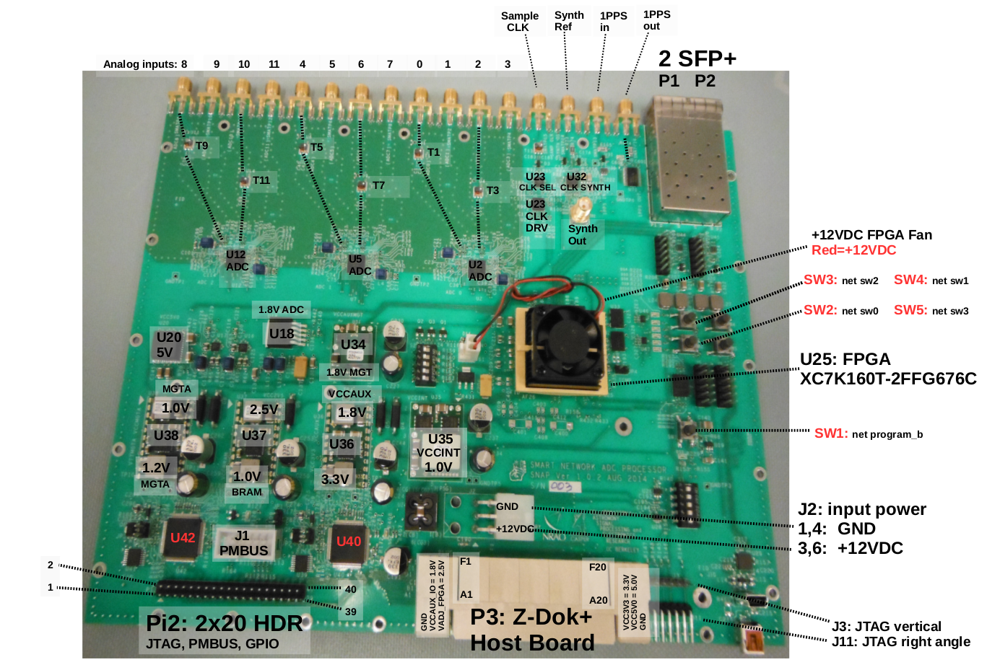

# Smart Network ADC Processor (SNAP)

## Developers

NRAO:  Rich Bradley, Joe Greenberg, Rich Lacasse, Robert Treacy

UC Berkeley: Dave DeBoer, Jack Hickish, Aaron Parsons, Dan Werthimer

## Description

SNAP is a low-cost FGPA board with on-board ADCs, frequency synthesizer, and two 10 Gb/s Ethernet ports.  This board is intended for digitizing data at each telescope of a large array, time stamping the data, and sending the ADC time domain data over Ethernet to a central computing facility. The board was designed for the Hydrogen Epoch of Reionization Array (HERA). 

The board could also be used as a low cost CASPER ADC and signal processing board for education and low to mid performance instrumentation. 

## Status
August 2016: SNAP is being used for various spectrometer apps at a handfull of institutions including UC Berkeley, JPL, and Swinburne. For availability information contact Mo Ohady at Digicom -- email mo@digicom.org

## Top-Level Specifications

**FPGA**

The SNAP features a XC7K160T-2FFG676C FPGA, though has been designed such that it can also accommodate larger XC7K325T-2FFG676C and XC7K410T-2FFG676C if necessary. See the [Xilinx Kintex 7 Product Table](http://www.xilinx.com/products/silicon-devices/fpga/kintex-7) for more information.

**ADC**

SNAP features three [HMCAD1511](http://www.analog.com/en/products/analog-to-digital-converters/hmcad1511.html) ADC chips. These can be operated as:
* three sets of 4 inputs at up to 250 Msps for a total of 12 inputs or
* three sets of 2 inputs at up to 500 Msps for a total of 6 inputs or
* three sets of 1 input at up to 1 Gsps for a total of 3 inputs _NB: we have seen problems operating above 950 Msps. Testing is recommended before choosing to use the SNAP in this mode._

**Processor**

The SNAP does not have an on-board processor, but can be used in conjunction with a [Raspberry Pi](http://www.raspberrypi.org) board connected via 40-pin ribbon cable. When used in this way, the SNAP interface uses the same `katcp` protocol used by ROACH and ROACH2 boards.

**Frequency synthesizer**
SNAP features a [TI LMX2581](http://www.ti.com/product/lmx2581#technicaldocuments) synthesizer. This requires an external reference (usually 10 MHz, though other frequencies are supported), and can be used to generate an appropriate sampling clock for the SNAP ADCs.

For more information on chipsets, see [the SNAP documentation repository](https://github.com/casper-astro/casper-hardware/tree/master/FPGA_Hosts/SNAP/documentation).

## Chassis
For use in HERA, an RFI-tight SNAP chassis, based on a Compac enclosure has been developed. See [here](https://github.com/casper-astro/casper-hardware/tree/master/FPGA_Hosts/SNAP/enclosure) for details.

A 1U chassis for a single board has also been delevoped. Details are available [here](https://github.com/casper-astro/publications/blob/master/Memos/files/1U-Snap-Enclosure-Pollak.pdf). A full set of design files can be obtained [here](https://github.com/casper-astro/casper-hardware/blob/master/FPGA_Hosts/SNAP/enclosure/1u-enclosure/1U-SNAP-Enclosure-Pollak.zip). 
